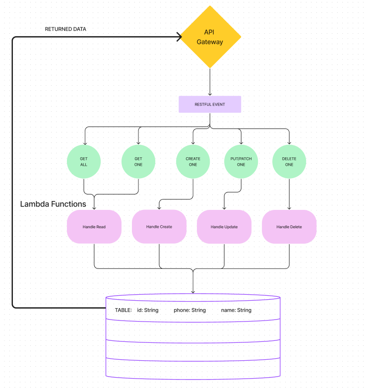

<!-- @format -->

# API- DYNAMO & LAMBDA

# LAB - 401-D49 Lab-18

## Project: Restful API

### Author: Lewis Benson

### Problem Domain

Create a fully RESTful application using the AWS Gateway, with DynamoDB and Dynamoose as an ORM.

### Links and Resources

[Invoke URL](https://w4e42i2xic.execute-api.us-east-1.amazonaws.com/production/friends)
This link returns

```js
{
"message": "Missing Authentication Token"
}
```

This is the same result as the [lab demo](https://3zl9q2okmd.execute-api.us-west-2.amazonaws.com/Production).

### Setup

#### `.env` requirements (where applicable)

There are no env requirements.

#### How to initialize/run your application (where applicable)

Inside the API Gateway, click on the RESTful action you wish to perform, add body for POST and PUT, and ADD ID for get one, delete one, and update one

#### Steps Create a new Table

Click services on the nav bar.

Hover `databases` -> click on DynamoDB

Click Create Table on the right,

Put in a table name, and select the data type for the key.

click create at the bottom.

#### Steps Create a Get Lambda

Click services on the nav bar.

Hover `compute` -> click on lambda

Click Create function

Check default rules

Select Node 16x

use x86_64

Create the function

```js
const dynamoose = require('dynamoose');

const schema = new dynamoose.Schema({
  id: Number,
  name: String,
  phone: String,
});

const friendsModel = dynamoose.model('friends', schema);

exports.handler = async (event) => {
  const response = {
    statusCode: null,
    body: null,
  };

  try {
    const id = +event.pathParameters.id;
    const record = await friendsModel.get({ id });
    response.statusCode = 200;
    response.body = JSON.stringify(record);
  } catch (e) {
    response.statusCode = 500;
    response.body = JSON.stringify(e.message);
    console.error(e.message);
  }
  return response;
};
```

#### Steps Setup permission

Highlight Security, Identity, & Compliance -> Click IAM

Click on roles.

You should see the role you created when you made the new lambda (see the name of the lambda function in the role name)

Check the policy listed, and click attach policies

Add the customer-managed new lambda in the name

attach AmazonDynamoFullAccess by searching Dynamo

Everything should be ready to perform DB functions at this point.

#### Features / Routes

/friends

- GET get all people
- POST create one person

/friends/:id

- GET get one person
- PUT update one person
- DELETE delete one person

#### Collaboration: I worked with Elias, Steven, and Seth to get out the primary function.

#### Tests

- How do you run tests?
  On the lambda function console, click the test button with a items in the database in the bucket.

# cloud-server


